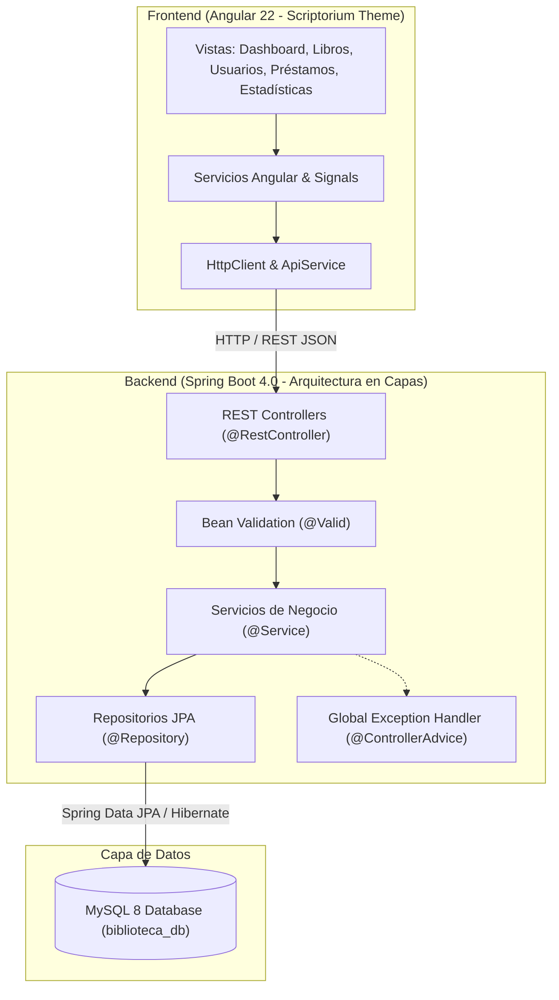
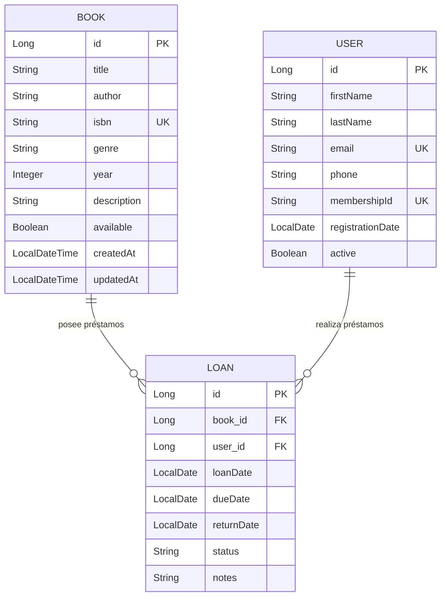

# 📚 BiblioVML — Sistema de Gestión de Biblioteca

Sistema completo de gestión de biblioteca desarrollado como prueba técnica. Incluye CRUD de libros, gestión de préstamos con reglas de negocio, y estadísticas analíticas con un diseño premium **glassmorphism/translúcido**.

## 🛠️ Stack Tecnológico

| Tecnología | Uso |
|:-----------|:----|
| **Spring Boot 4.0** | Backend / API REST |
| **Java 21** | Lenguaje backend |
| **MySQL 8** | Base de datos |
| **Angular 22** | Frontend SPA |
| **Vanilla CSS** | Estilos (Glassmorphism Design System) |

## 📋 Funcionalidades

### CRUD de Libros
- Crear, leer, actualizar y eliminar libros
- Campos: título, autor, ISBN (único), género, año, descripción, disponibilidad
- Búsqueda por título o autor
- Validaciones en formularios (frontend y backend)

### Gestión de Usuarios
- CRUD completo de miembros de la biblioteca
- Email único por usuario
- Membresía auto-generada
- Estado activo/inactivo

### Gestión de Préstamos
- Registro de préstamos con reglas de negocio:
  - ❌ Solo libros disponibles
  - ❌ Solo usuarios activos
  - ❌ Máximo 3 préstamos activos por usuario
  - ✅ Plazo automático de 14 días
  - ✅ Devolución con liberación del libro
- Estado: ACTIVE / RETURNED / OVERDUE
- Filtrado por estado

### Estadísticas
- 📊 Dashboard con KPIs (total libros, usuarios, préstamos activos/vencidos)
- 🏆 Top 5 libros más prestados
- 📅 Préstamos por mes (últimos 6 meses) — gráfico de barras CSS
- 📚 Distribución por género literario — barras horizontales
- 👤 Usuarios más activos

## 🏗️ Arquitectura

### Backend (MVC + Capas)



- **Controllers**: Endpoints REST (`/api/books`, `/api/users`, `/api/loans`, `/api/stats`)
- **Services**: Lógica de negocio, validaciones, reglas de préstamo
- **Repositories**: Spring Data JPA con queries JPQL custom
- **DTOs**: Transferencia de datos desacoplada de entidades
- **Exception Handler**: `@ControllerAdvice` para manejo global de errores

### Modelo de Datos (Entidad - Relación)



### Frontend (Standalone Components)
```
App (Sidebar + Router)
├── Dashboard
├── Books (CRUD)
├── Users (CRUD)
├── Loans (Gestión)
└── Statistics (Charts CSS)
```

- **Angular Signals** para estado reactivo
- **Lazy loading** de rutas para optimización
- **Design System** glassmorphism con CSS custom properties
- **Responsive** mobile-first

## 🚀 Cómo Ejecutar

### Prerequisitos
- Java 21+
- Node.js 20+
- MySQL 8+ (corriendo en localhost:3306)

### Backend
```bash
cd backend

# Configurar contraseña MySQL en application.properties si es diferente a 'root'

# Ejecutar (Maven wrapper incluido, no requiere instalación)
./mvnw spring-boot:run    # Linux/Mac
mvnw.cmd spring-boot:run  # Windows
```
El servidor inicia en `http://localhost:8080`

### Frontend
```bash
cd frontend
npm install     # Solo la primera vez
ng serve        # o: npx @angular/cli serve
```
La app inicia en `http://localhost:4200`

### Ejecutar Tests
```bash
cd backend
./mvnw test     # Linux/Mac
mvnw.cmd test   # Windows
```

## 📁 Estructura del Proyecto

```
vml/
├── backend/                        # Spring Boot API
│   ├── src/main/java/com/vml/biblioteca/
│   │   ├── config/                 # CORS configuración
│   │   ├── controller/             # REST Controllers
│   │   ├── dto/                    # Data Transfer Objects
│   │   ├── entity/                 # Entidades JPA
│   │   ├── exception/              # Excepciones + GlobalHandler
│   │   ├── repository/             # Repositorios JPA
│   │   └── service/                # Servicios de negocio
│   └── src/test/                   # Tests unitarios
├── frontend/                       # Angular App
│   └── src/app/
│       ├── core/                   # Servicios (API, Book, User, Loan, Stats)
│       └── features/               # Páginas (Dashboard, Books, Users, Loans, Stats)
└── README.md
```

## 🧪 Tests Unitarios

- **BookServiceTest**: CRUD, validación ISBN único, búsqueda
- **LoanServiceTest**: Reglas de negocio (disponibilidad, límite, usuario activo, devolución)

## 🎨 Diseño

- **Glassmorphism**: Cards translúcidas con `backdrop-filter: blur()`
- **Dark Theme**: Paleta oscura con acentos vibrantes (púrpura, cyan, rose)
- **Micro-animaciones**: Hover effects, transiciones suaves, entradas animadas
- **Responsive**: Sidebar colapsable en mobile, grids adaptativos
- **Typography**: Google Fonts (Inter + Outfit)

---

Desarrollado con ❤️ para prueba técnica JR Developer
