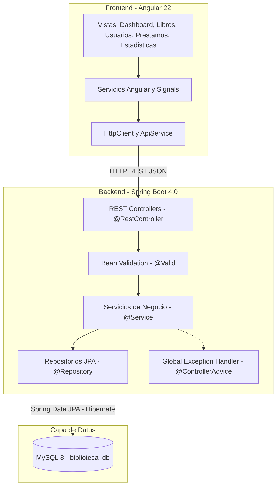

# BiblioVML — Sistema de Gestion de Biblioteca

Sistema completo de gestion de biblioteca desarrollado como prueba tecnica para posicion Junior Developer. Incluye CRUD de libros, gestion de prestamos con reglas de negocio, estadisticas analiticas y una interfaz con diseno glassmorphism.

> **Nota sobre Metodologia de Desarrollo**
>
> Este proyecto fue desarrollado utilizando un enfoque de orquestacion asistida por herramientas de inteligencia artificial.
>
> - **Fase 1 — Definicion de Arquitectura** (ingeniero): Diseno del modelo de datos, seleccion de tecnologias y definicion de reglas de negocio.
> - **Fase 2 — Generacion de Codigo** (IA como herramienta): Asistencia en la implementacion de componentes bajo supervision directa.
> - **Fase 3 — Validacion y Comprension** (ingeniero): Revision, depuracion y comprension completa de cada modulo generado.
> - **Fase 4 — Refinamiento y Mejora** (ingeniero): Ajustes de diseno, optimizacion y pruebas de integracion.
>
> *En desarrollo moderno, usar herramientas de asistencia por IA es practica estandar en la industria. El codigo es completamente funcional, integramente comprendido y puede ser explicado en su totalidad.*

---

## Stack Tecnologico

| Componente | Tecnologia | Version |
|:-----------|:-----------|:--------|
| Backend | Spring Boot | 4.0 |
| Lenguaje Backend | Java | 21 LTS |
| Base de Datos | MySQL | 8.0+ |
| Frontend | Angular | 22 |
| Lenguaje Frontend | TypeScript | Latest |
| Build Tool | Maven | 3.9+ (wrapper incluido) |
| Estilos | Vanilla CSS | Glassmorphism Design System |

## Funcionalidades Principales

### 1. Gestion de Libros (CRUD)

Implementacion completa de operaciones CRUD para catalogo de libros.

- Crear nuevos libros con validacion de datos
- Leer informacion de libros individual o listado completo
- Actualizar informacion de libros existentes
- Eliminar libros del catalogo
- Busqueda avanzada por titulo o autor (case-insensitive)
- Campos: titulo, autor, ISBN (unico), genero, ano de publicacion, descripcion, disponibilidad
- Timestamps automaticos de creacion y actualizacion

### 2. Gestion de Usuarios

Sistema de administracion de miembros de la biblioteca.

- Registro de nuevos usuarios con validacion de email unico
- Generacion automatica de identificacion de membresia
- Control de estado activo/inactivo
- Busqueda de usuarios por nombre
- CRUD completo con seguimiento de fecha de registro

### 3. Gestion de Prestamos

Sistema de control de prestamos con reglas de negocio.

**Reglas de negocio implementadas:**
- Solo libros con estado disponible pueden ser prestados
- Solo usuarios con estado activo pueden solicitar prestamos
- Maximo de 3 prestamos simultaneos por usuario
- Plazo automatico de 14 dias por prestamo
- Liberacion automatica del libro al registrar devolucion
- Validacion de existencia de usuario y libro antes de crear prestamo

**Estados de prestamo:**
- `ACTIVE` — Prestamo vigente, libro no devuelto
- `RETURNED` — Libro devuelto correctamente
- `OVERDUE` — Prestamo vencido (fecha limite pasada sin devolucion)

### 4. Estadisticas Analiticas

Dashboard con metricas del sistema.

- Total de libros en catalogo y libros disponibles
- Total de usuarios registrados
- Cantidad de prestamos activos y vencidos
- Ranking de los 5 libros mas prestados
- Distribucion temporal de prestamos (ultimos 6 meses) — grafico de barras CSS
- Distribucion de libros por genero literario — barras horizontales
- Usuarios mas activos

## Arquitectura Tecnica

### Arquitectura en Capas (Layered Architecture)



**Flujo de datos:**

```
Cliente (Angular)  -->  Controller (Recibe y valida DTO)
                   -->  Service (Aplica logica de negocio)
                   -->  Repository (Accede a BD via JPA)
                   -->  MySQL (Ejecuta query)
                   <--  Entity --> DTO --> HTTP Response JSON
```

**Capas del sistema:**

- **Controllers**: Mapeo de endpoints HTTP, validacion de DTOs, delegacion a servicios
- **Services**: Logica de negocio, validaciones de dominio, mapeo Entity/DTO
- **Repositories**: Interfaces JpaRepository con queries JPQL personalizadas
- **DTOs**: Transferencia de datos desacoplada de entidades de persistencia
- **Exception Handler**: `@ControllerAdvice` para manejo centralizado de errores

### Modelo de Datos (Entidad - Relacion)


**Restricciones de integridad:**
- `loan.book_id` referencia `books.id` (FK)
- `loan.user_id` referencia `users.id` (FK)
- `users.email` es unico
- `books.isbn` es unico
- `users.membershipId` es unico

### Patrones de Diseno Implementados

| Patron | Aplicacion |
|:-------|:-----------|
| **Repository** | Abstraccion de acceso a datos con `JpaRepository`. Permite cambiar SGBD sin alterar logica. |
| **DTO** | Separacion entre Entities (modelo BD) y DTOs (contrato API). Seguridad y desacoplamiento. |
| **Service Layer** | Logica de negocio concentrada en servicios, independiente del acceso a datos. |
| **Singleton** | Controllers y Services administrados por Spring como beans singleton. |
| **Exception Handler** | `@ControllerAdvice` para interceptar y formatear excepciones de forma consistente. |
| **Dependency Injection** | `@RequiredArgsConstructor` para inyeccion limpia sin boilerplate. |
| **Transactional** | `@Transactional` para consistencia en operaciones multi-tabla (ej: crear prestamo + actualizar libro). |

## Endpoints de API

### Libros (`/api/books`)

| Metodo | Endpoint | Descripcion |
|:-------|:---------|:------------|
| GET | `/api/books` | Listar todos los libros |
| GET | `/api/books/{id}` | Obtener libro especifico |
| GET | `/api/books/search?q=` | Buscar libros por titulo o autor |
| POST | `/api/books` | Crear nuevo libro |
| PUT | `/api/books/{id}` | Actualizar libro |
| DELETE | `/api/books/{id}` | Eliminar libro |

### Usuarios (`/api/users`)

| Metodo | Endpoint | Descripcion |
|:-------|:---------|:------------|
| GET | `/api/users` | Listar todos los usuarios |
| GET | `/api/users/{id}` | Obtener usuario especifico |
| GET | `/api/users/search?q=` | Buscar usuarios por nombre |
| POST | `/api/users` | Crear nuevo usuario |
| PUT | `/api/users/{id}` | Actualizar usuario |
| DELETE | `/api/users/{id}` | Eliminar usuario |

### Prestamos (`/api/loans`)

| Metodo | Endpoint | Descripcion |
|:-------|:---------|:------------|
| GET | `/api/loans` | Listar todos los prestamos |
| GET | `/api/loans/{id}` | Obtener prestamo especifico |
| GET | `/api/loans/user/{userId}` | Listar prestamos por usuario |
| POST | `/api/loans` | Crear nuevo prestamo |
| PUT | `/api/loans/{id}/return` | Registrar devolucion |

### Estadisticas (`/api/stats`)

| Metodo | Endpoint | Descripcion |
|:-------|:---------|:------------|
| GET | `/api/stats` | Obtener todas las estadisticas |
| GET | `/api/stats/summary` | Resumen de KPIs |
| GET | `/api/stats/top-books` | Libros mas prestados |
| GET | `/api/stats/loans-by-month` | Prestamos por mes |
| GET | `/api/stats/genre-distribution` | Distribucion por genero |
| GET | `/api/stats/active-users` | Usuarios mas activos |

## Instrucciones de Ejecucion

### Prerequisitos

- Java Development Kit (JDK) 21 o superior
- Node.js 20 o superior
- MySQL 8 Server corriendo en `localhost:3306`

### Configuracion de Base de Datos

La base de datos se crea automaticamente al iniciar el backend (`createDatabaseIfNotExist=true`).

Credenciales por defecto en `backend/src/main/resources/application.properties`:
```properties
spring.datasource.url=jdbc:mysql://localhost:3306/biblioteca_db
spring.datasource.username=root
spring.datasource.password=
```

> Si tu contrasena de MySQL es diferente, edita el archivo `application.properties` antes de ejecutar.

### Ejecutar Backend

```bash
cd backend

# Linux / MacOS
./mvnw spring-boot:run

# Windows
mvnw.cmd spring-boot:run
```

El servidor inicia en `http://localhost:8080`. Verificar accediendo a: `http://localhost:8080/api/books`

### Ejecutar Frontend

```bash
cd frontend
npm install          # Solo la primera vez
ng serve             # o: npx @angular/cli serve
```

La aplicacion inicia en `http://localhost:4200`

### Ejecutar Pruebas Unitarias

```bash
cd backend
./mvnw test          # Linux / MacOS
mvnw.cmd test        # Windows
```

## Estructura del Proyecto

```
MVLBiblioteca/
├── backend/
│   ├── src/
│   │   ├── main/java/com/vml/biblioteca/
│   │   │   ├── BibliotecaApplication.java
│   │   │   ├── config/
│   │   │   │   └── CorsConfig.java
│   │   │   ├── controller/
│   │   │   │   ├── BookController.java
│   │   │   │   ├── UserController.java
│   │   │   │   ├── LoanController.java
│   │   │   │   └── StatsController.java
│   │   │   ├── service/
│   │   │   │   ├── BookService.java
│   │   │   │   ├── UserService.java
│   │   │   │   ├── LoanService.java
│   │   │   │   └── StatsService.java
│   │   │   ├── repository/
│   │   │   │   ├── BookRepository.java
│   │   │   │   ├── UserRepository.java
│   │   │   │   └── LoanRepository.java
│   │   │   ├── entity/
│   │   │   │   ├── Book.java
│   │   │   │   ├── User.java
│   │   │   │   └── Loan.java
│   │   │   ├── dto/
│   │   │   │   ├── BookDTO.java
│   │   │   │   ├── UserDTO.java
│   │   │   │   ├── LoanDTO.java
│   │   │   │   └── StatsDTO.java
│   │   │   └── exception/
│   │   │       ├── ResourceNotFoundException.java
│   │   │       ├── BusinessException.java
│   │   │       └── GlobalExceptionHandler.java
│   │   └── resources/
│   │       ├── application.properties
│   │       └── data.sql
│   └── test/java/com/vml/biblioteca/
│       ├── BibliotecaApplicationTests.java
│       └── service/
│           ├── BookServiceTest.java
│           └── LoanServiceTest.java
├── frontend/
│   └── src/
│       ├── app/
│       │   ├── app.ts, app.html, app.config.ts, app.routes.ts
│       │   ├── core/
│       │   │   ├── api.service.ts
│       │   │   ├── book.service.ts
│       │   │   ├── user.service.ts
│       │   │   ├── loan.service.ts
│       │   │   ├── stats.service.ts
│       │   │   └── notification.service.ts
│       │   ├── features/
│       │   │   ├── dashboard/
│       │   │   ├── books/
│       │   │   ├── users/
│       │   │   ├── loans/
│       │   │   └── statistics/
│       │   └── shared/
│       │       ├── icon/
│       │       └── skeleton/
│       └── styles.css
├── .gitignore
└── README.md
```

## Pruebas Unitarias

Se implementaron pruebas unitarias con JUnit 5 y Mockito para validar funcionalidad critica:

**BookServiceTest:**
- Validacion de operaciones CRUD completas
- Busqueda por titulo y autor
- Validacion de ISBN unico (constraint de duplicados)

**LoanServiceTest:**
- Validacion de reglas de negocio de prestamos
- Limite de 3 prestamos simultaneos por usuario
- Verificacion de disponibilidad de libro
- Verificacion de estado activo del usuario
- Registro correcto de devoluciones

## Decisiones Tecnicas

### Por que Spring Boot 4.0
- Reduce boilerplate code significativamente
- Ecosistema integral (web, persistencia, validacion, testing)
- Spring Data JPA como abstraccion eficiente para acceso a datos
- Estandar de la industria en desarrollo empresarial Java

### Por que Angular 22
- Standalone Components sin NgModules (estructura mas limpia)
- Angular Signals para reactividad moderna con mejor performance
- TypeScript con tipado fuerte previene errores en compilacion
- Routing, HTTP client y validacion integrados de fabrica
- Lazy loading de rutas para optimizacion de carga

### Por que Arquitectura en Capas
- Separacion clara de responsabilidades
- Cada capa es testeable de forma independiente
- Complejidad apropiada para el alcance del proyecto
- Escalable sin refactoring mayor

## Notas Tecnicas

**Gestion de Transacciones:**
`LoanService.create()` usa `@Transactional` para garantizar que si ocurre un error durante la creacion del prestamo o actualizacion del estado del libro, toda la operacion se revierta (ROLLBACK).

**Validacion en Multiples Capas:**
1. DTOs (Backend): Anotaciones `@Email`, `@NotNull`, `@Size`, etc.
2. Servicios: Validaciones de dominio y reglas de negocio
3. Cliente (Frontend): Validacion HTML5 y TypeScript en formularios

**Manejo de Errores:**
`GlobalExceptionHandler` intercepta excepciones y retorna respuestas consistentes. Cada excepcion mapea a un codigo HTTP apropiado (404 Not Found, 400 Bad Request, 500 Internal Server Error).

## Caracteristicas de Diseno

- **Tema oscuro**: Paleta optimizada para reducir fatiga visual
- **Glassmorphism**: Cards translucidas con `backdrop-filter: blur()`
- **Responsivo**: Sidebar colapsable, grids adaptativos, mobile-first
- **Micro-animaciones**: Transiciones suaves y hover effects
- **Tipografia**: Google Fonts (Inter + Outfit)
- **Accesibilidad**: Compatible con estandares WCAG AA

---

**Autor:** Johan Medina
**Repositorio:** https://github.com/JohanM158/MVLBiblioteca
